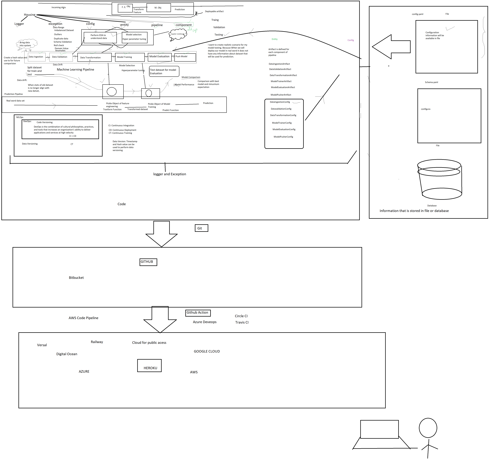
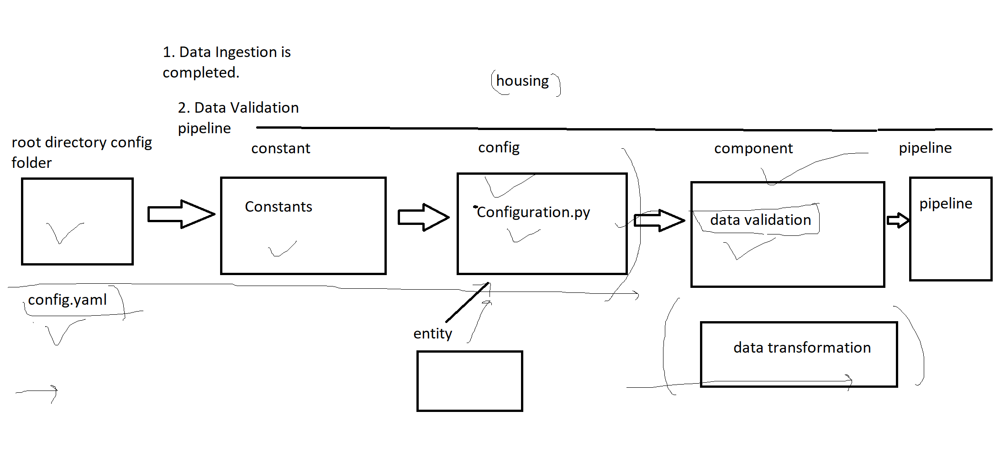
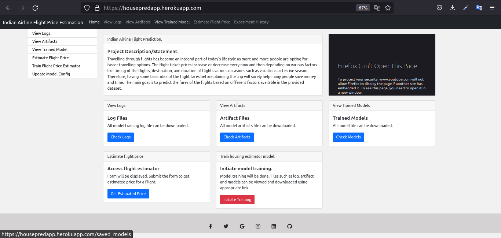
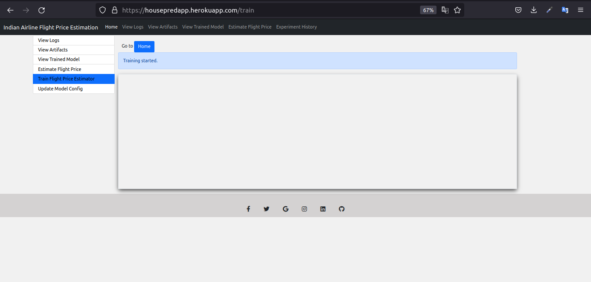
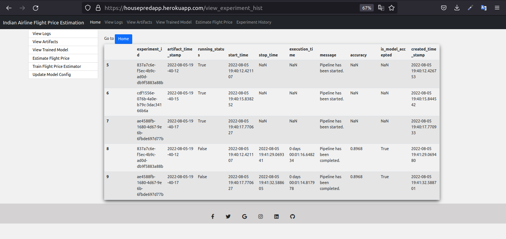
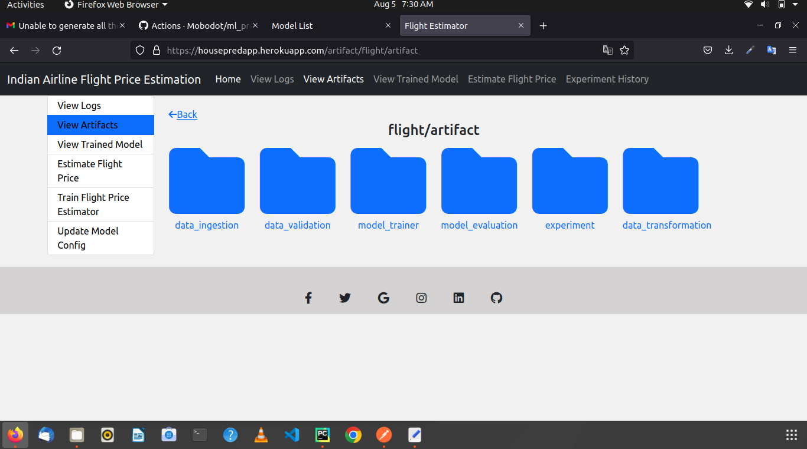
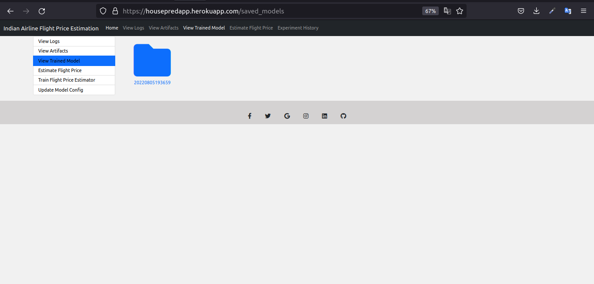
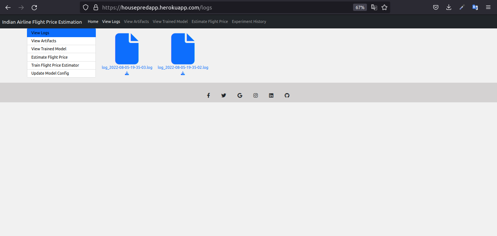

# Project Description
This is an end to end ML project for Indian Flight Price Prediction, which consists of all the components that make up 
a machine learning project such as data ingestion, data validation, data transformation, model training, model 
evaluation and model pusher.


NB: This project also uses a CI/CD Pipeline using `Github Actions` and `Heroku`.


# Problem Statement
Travelling through flights has become an integral part of today’s lifestyle as more and  more people are opting for 
faster travelling options. The flight ticket prices increase or  decrease every now and then depending on 
various factors like timing of the flights,  destination, and duration of flights various occasions such as 
vacations or festive  season. Therefore, having some basic idea of the flight fares before planning the trip will  
surely help many people save money and time. 

The main goal is to predict the fares of the flights based on different factors available in  the provided dataset.

The dataset was gotten from kaggle: [dataset link](https://www.kaggle.com/datasets/nikhilmittal/flight-fare-prediction-mh)

# === Project solution ===
## Code Architecture


## Low level design flow summary


## How to run:
1. Download the code from my repository.
2. Open the project folder on any IDE or text editor. E.g: Pycharm or Vscode
3. Lastly, simply run ```pip install requirements.txt```

## Technologies used:
1. Python
2. Html/css/Bootstrop
3. Flask
4. Github & Github Actions
5. Docker
6. Flask

App link: [flightapp](https://housepredapp.herokuapp.com)

## Application Images
```Home page```


```Model training```


```Training history```


```Artifacts after model training```


```Model generated after training```


```Application logs```


